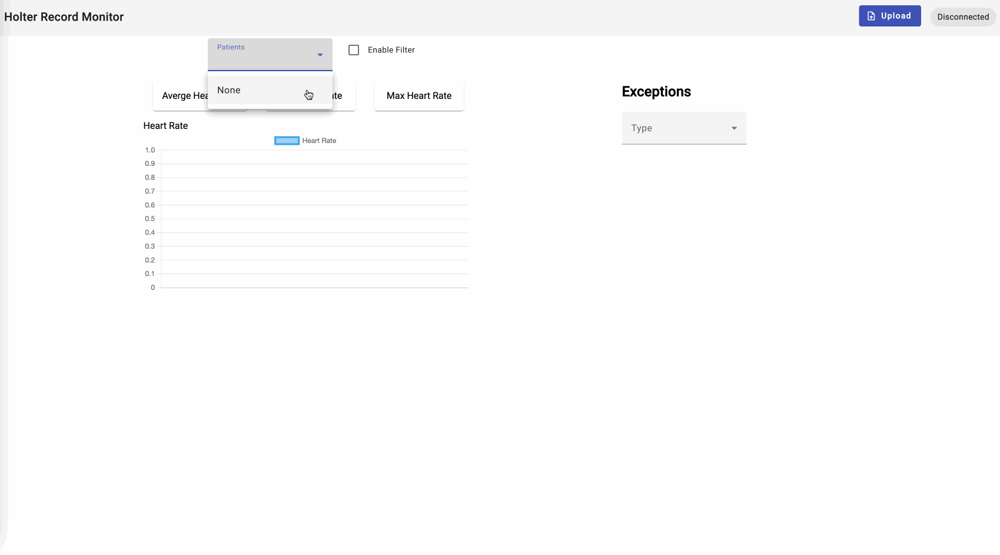

# Holter Record Monitor

✨ **This workspace has been generated by [Nx, a Smart, fast and extensible build system.](https://nx.dev)** ✨

This is a monitor screen that doctor can check the ECG data for the patient.
Doctor can choose any patient and get the summary from the csv file. Check the overal heart rate/min heart rate/max heart rate and line chart with all heart rate, exceptional heart rate activity.

## Start the app

To start the server run `npm start`. To start the angular app run `npm run dev`. Open your browser and navigate to http://localhost:3000/.
You can upload csv file by yourself. Or you can wait notifications when there is new data arrival.

Happy exploring!

## How to add new data:

The backend need three type of data:

- patient name: which allow doctor to identify the patient later
- start time. the start time of csv record time. Act as a base time for csv rows
- csv file with columns order: type | waveOn | waveEnd | tags. waveOn/waveEnd is reprensent by milleseconds.

example csv file [here](./asset/record.csv).

csv file row example: QRS 7221 7316 junctional
means QRS wave detected 7221 milleseconds after the data record starting
and after (7316ms - 7221ms) = 95ms QRS wave finish.

How you can upload data to analysis:

1. upload via the upload button on our client.
2. upload via postman
3. upload by post request from any system.

Here to play it on your own with postman:

## Tech

Project implemented with Angular17 nestjs10, node version : 18.18.2

## Terms

Heart Rate: the way we calculate the heart rate is to count the number of QRS wave in one minute. Thus except the average heart rate, other heart rate means the heart rate of the minute according to thegiven time.

## Architecture

In the backend we have 3 endpoint

- a post method: which accept the csv file and patient name also the start time to start the analysis
- a websocket: so that the client can get notified when new data arrive
- a get method: which will return the holter record summary according to the user and time slot.

Time format:
Since in ECG data millesecond is widely used to measure the wave. And as it's number, it can be easily filter in database or calculate during the runing time. In the meantime, the ECG data normally should be based on the current time which means time greater than 1970. So with millesecond data it is enough for us in current situation.

On the client side.
There will be a websocket to notifiy client that new data comes.
When doctor notice new data comes, he or she can check the key parameters abstracted from holter record and the trend of heart rate.
Along with the heart rate line chart, doctor can determine if the exception activity is normal or not.

## what's next:

- Improve time slot component
- Implement sql database to save data to simply the data management process on backend
- UI fine tuning
- Error handling
- Code review.
- Unit test.
